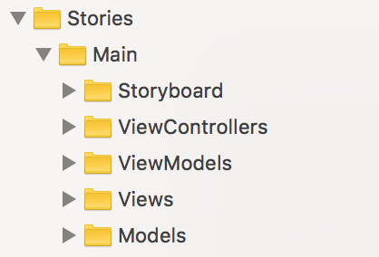

# BitcoinRate

Hi, fellow Reviewer,

This document will help you build the project and walk you through into some of the specifics of the project. I hope you’ll enjoy reviewing my code.

Cheers !

## Requirements

- Xcode 9.3+ 
- iOS 11.0+ 
- Swift 4.0+

## Building the project

This project use [Cocoapods](https://cocoapods.org). Tap the following commands in the root directory 

```
$> sudo gem install cocoapods
$> pod install
```

It will generate a file **BitcoinRate.xcworkspace**. Open the project with it (not with BitcoinRate.xcodeproj)

## Project Architecture

The architecture evolves around “Stories” where, in the future, whenever the project grows, we can separate different screen logic that represent a new story (ex: Login screens, User Settings screens).

A Story is composed of a Storyboard, ViewControllers, ViewModels and Views directories. This way, it is easy to navigate between classes that are linked inside a same story.



When possible, MVVM is used.

## Watch Extension

The extension uses WatchConnectivity framework to communicate with the iPhone.
When the watch opens the app, it will wake up the iOS app with an Interactive message. The iOS app then will fetch the new data (cache and/or network) and returns it with the *updateApplicationContext* method.

Note:

We could also have used *URLSession* within the watch app. But, in order to not over complicate the project, we will stick with this process for now. 

```
Watch ->         sendMessage          -> iOS
                                          | Fetch new data
      <-   updateApplicationContext   <-
```

## Notes about the challenge

- The optional Today Extension is not implemented
- The optional continuous refresh of the current exchange rate BTC/EUR is not implemented

## Cocoapods

Two framework are used with Cocoapods:

#### [StringExtensionHTML](https://github.com/adela-chang/StringExtensionHTML)

Small helper to nicely convert html code to formatted string. (Coindesk api returns symbols' codes)

#### [PromiseKit](https://github.com/mxcl/PromiseKit)

This pod is used in WatchSessionManager to combine nicely two network calls before returning both results to the Watch

## Testing

To test different parts of the project, I use the Xcode test framework.

There's not a lot to test in UI. But you will find one that demonstrate the use of Mock ressources using *launchEnvironment* a the beginning of the test.

## Documentation

The [documentation](./docs) is generate with [Jazzy](https://github.com/realm/jazzy). We can re-generate an update documentation with the following commandline :

```
jazzy --min-acl internal -x -workspace,BitcoinRate.xcworkspace,-scheme,BitcoinRate
```